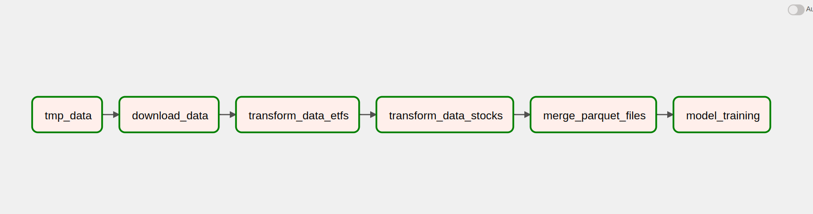

# Work Sample for Data Engineer

To effectively solve the following data pipeline problems, it is essential to use a DAG (Directed Acyclic Graph) oriented tool. DAG tools like Pachyderm, Airflow, Dagster, etc., can help streamline data processing and management with tracking data lineage, ensuring data integrity, and minimizing errors during processing.

To provide more context and clarity, including pipeline specs and diagrams can be helpful. These artifacts can help visualize the DAG and its components, provide information on how data flows through the pipeline, and highlight the dependencies between tasks.

## Pipeline : 

```
    tmp_data >> download_data_task >> transform_data_task_etfs >> transform_data_task_stocks >> merget_parquet_files >> model_training 
```
1. tmp_data: folder structure is created for storing data at various stages of processing. 
2. download_data_task : Downloads the data from the kaggle api end point and stores it in the tmp_data folder.
3. transform_data_task_etfs : Reads the data from the tmp_data folder and performs the necessary transformations on the data. 
4. transform_data_task_stocks : Reads the data from the tmp_data folder and performs the necessary transformations on the data.
5. merge_parquet_files : Reads the data from the tmp_data folder and performs the necessary transformations on the data.
6. model_training : Reads the data from the tmp_data folder and performs the necessary transformations on the data.

* steps 3 and 4 could be run in parallel in my case the resources werent enough to do so. Hence ran them as sequential tasks. 



## Problem 1: Raw Data Processing
1. Download the data using kaggle api end points to store and extract the contents.
2. Store the data at certain location for further data cleaning and processing.
3. Ensure necessary folders are created so the data can be written to the location further.

## Problem 2: Feature Engineering
1. Read the data from the location where it is stored.
2. Clean the data by removing the null values and duplicates.
3. Create new features from the existing features.
4. Perform rolling aggregation on the data. 
5. Perform merge operation on the parquet file so that the data is in a single file.
6. Store the resulting data for training.

## Problem 3: Integrate ML Training
1. Read the parquet files and run RandomForestRegression as suggested to train the model. 
2. Store the model in the location for further use.
 
## Problem 4: Model Serving 
1. Read the model from the location where it is stored. 
2. Create an API endpoint to serve the model. 
3. Model training for this was done on kaggle notebook as I couldnt train them locally due to memory constraints.
4. Couldnt complete the serving part as the model training came up to 9GB.
5. Link to notebook : https://www.kaggle.com/code/vardhan13/notebookb2cd139c81

### TODO 

1. Working on integration spark clusters to the docker-compose so that Airflow can submit data intensive tasks to spark cluster.
2. Worked extensively on setting up spark but kept running into issues with the spark cluster worker getting disconnected constantly. 
3. Figure out why restarting worker is resulting in dropping the airflow scheduler, which results in failure to schedule further tasks in the piepline. 